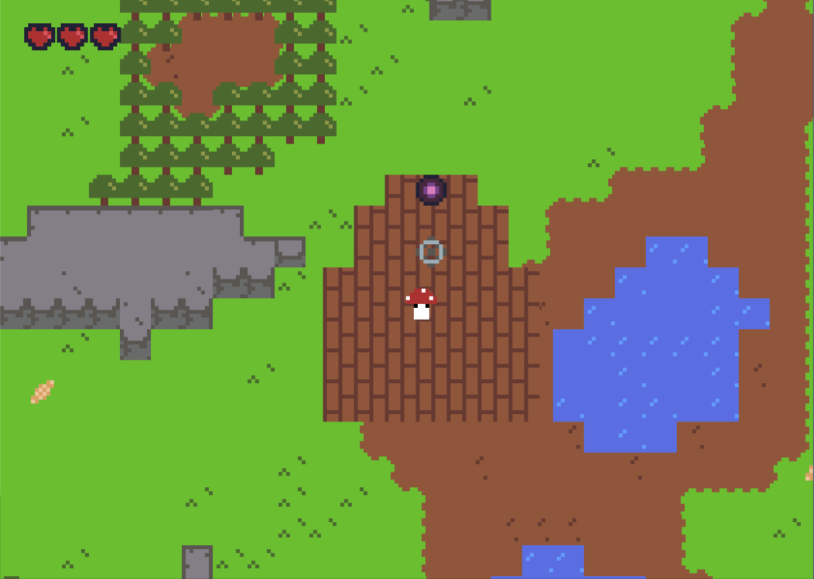

# Aether of Enclaves
[](https://travis-ci.org/swamulism/aether_of_enclaves)

This is a 2D, 8bit exploration game built with Rust. The player controls an airship and its captain, flying amongst explorable floating islands. For more information on our design and development plans, please refer to the design document.


## Screenshot



## Compile & Run
[Rust](https://www.rust-lang.org/en-US/install.html) (and Cargo) must be installed in order to build (for Windows users, Visual Studio C++ must also be installed). Dependencies are handled by Cargo. An executable is created with each build. The following command can be used to compile & run:

```
cargo run --release
```


## Built With

* [Rust](https://www.rust-lang.org/en-US/) - Programming language
* [Piston](https://github.com/PistonDevelopers/piston) - Game Engine


## Creators

* **Samuel Eubanks** samuel.eubanks@colorado.edu
* **McKenzie Weller** mckenzie.weller@colorado.edu
