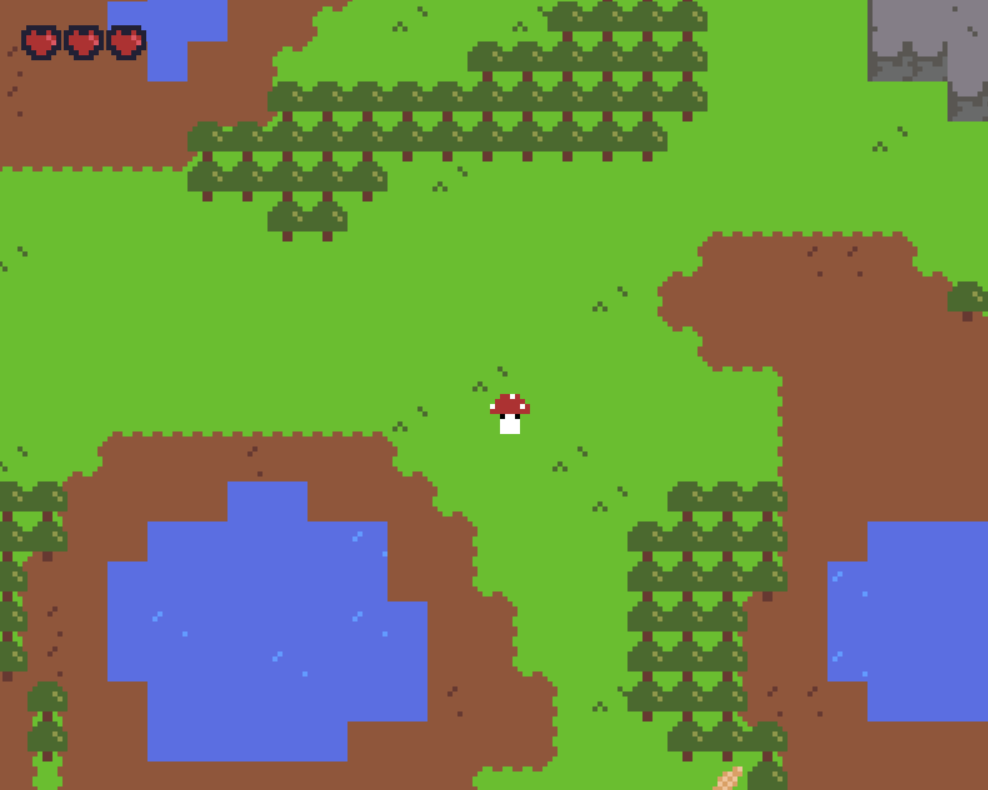

# Final

[Latest Commit]()

[Version 0.1.0 Release](https://github.com/swamulism/aether_of_enclaves/releases/tag/0.1.0)

1. What was planned for this deadline, from our check-in before break:
     - We want to make the world generation a bit more advanced - this is intentionally vague, because this could head in a number of directions.
    - We'd like to have the main character move on the world itself (move from ship to world and back).
    - Finish the item interaction mentioned above (picking them up, throwing them).
    - Rewrite a large number of comments and tests, as the large number of updates how outdated a lot of these.

2. What was accomplished:
    - The world generation is more advanced - we added more tile types and the algorithm was refined (a bit). We also are generating a larger world, which lags a little when the screen is full-sized, but we managed to handle some of the lagging.
    - The main character can move from the ship to the world using the "portal" on the ship. The main character can walk on grass and dirt, but not stone and water. A portal is placed on the ground, so the player can get back on the ship.
    - We are randomly generating the same item on the map at a fixed rate (a bisket), which the player can pick up, drop, and eat to gain another heart (health). The character will carry the item around with it until it is consumed or dropped.
    - All of our comments were rewritten / updated, plus the tests were updated as well. We found excessive testing to be unneccesary, because the Rust compiler is extremely thorough and thus tests cases that we would normally write unit tests for (in say C++).
    - We made our own graphics (finally) and decided to convert to an 8x8 graphic style. We are using a new constants system to help with accessing graphics globally throughout the code. We designed our own animations for the player (moving and idle) and have animated the water. A lot of logic (and hash maps) went into tiling the world with various tile sets to add dimension. It looks a lot better!
    - We changed some of the controls (and added a menu to inform the user how to play), which makes the MC more sensitive to the world around it. E.g. the player must now be standing on the portal, the wheel to interact with it, or holding an item to use it. This "action" button is E. To pick up / drop an item, use Space.
    - A lot of code was cleaned up / modularized. Drawing functions were separated into their respective objects, for example. We've been pretty impressed with our code health - changing up the graphics was surprisingly painless (considering we were going from 32x32 to 8x8).
    - Lots of bug fixes with interacting between the ship and the world below. A lot more collision detection.

3. Planned for next deadline:
    - We're free :)

4. Demo clip below.

