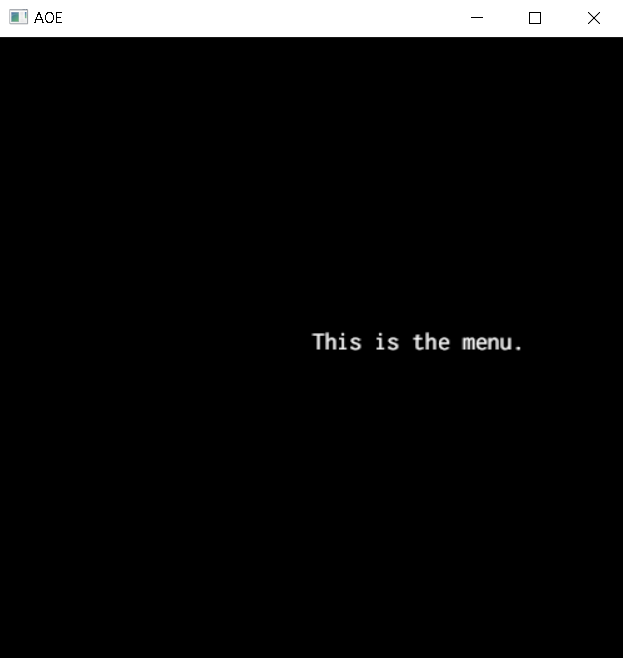
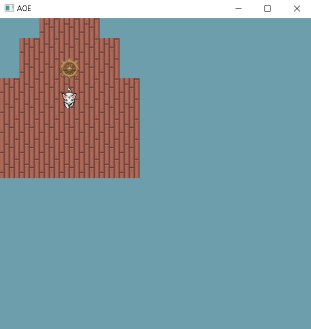
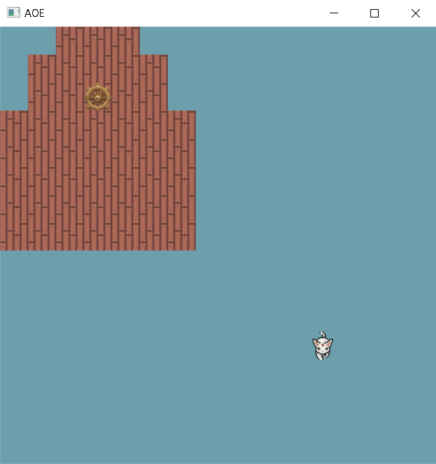
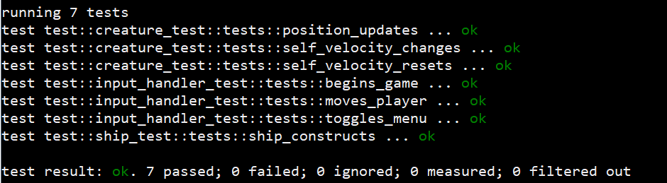
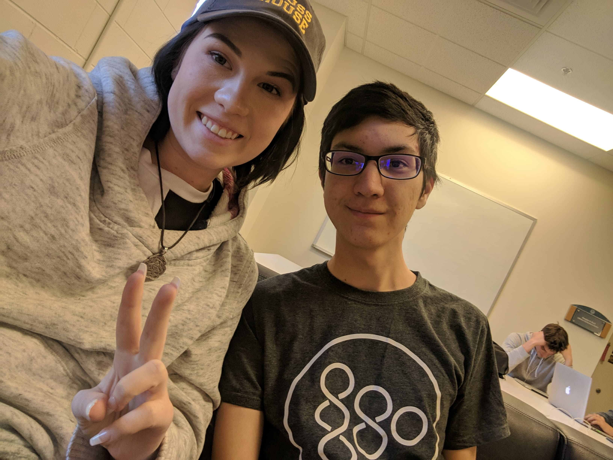

# Homework 4

[Latest Commit](https://github.com/swamulism/aether_of_enclaves/commit/5791cb2287095e4e2cef75fe80f4c9c6821ae710)

[Version 0.0.2 Release](https://github.com/swamulism/aether_of_enclaves/releases/tag/0.0.2)

1. What was planned for this deadline, from our design document:
    - Implementation of Airship and Player class integrated with the Game. 
    - Graphics code for Airship and Player written in Flyweight class. 
    - Testing for Airship, Player, and Input class developed. 
    - If possible, beginnings of enumerations for NPC classes. 

2. What was accomplished:
    - Our biggest accomplishment was introducing external graphics into the game (this was a lot of pain and suffering with Rust).
    - The graphics code is handled using a Piston graphics import called Texture, with graphics stored in a HashMap (similarly to how we did in class using Python). This is how we are implementing the Flyweight design pattern. 
    - A new module for testing was created and contains a mix of unit and integration testing for the three classes we planned to test: Ship, Player, and Input. All of our tests pass (see screenshot below). We did change our testing plan - instead of using Stainless we used the built-in testing framework for Rust.
    - We decided to make the "Player" object a more generic "Creature" object which can be used as a template for NPCs as well. We expanded upon this object to make the movement more cohesive and game-proper, and allow for variation with future types of Creatures.
    - We began writing the Ship object and have the framework down for making it move based on Player command and including other features (health, acceleration, different types of tiles, different sizes of ships). Incorporated with this is the Tile class (another new object) which provides permutations for the tiles used in generating ship, world, and other textures, etc.
    - The Player and the Ship both appear on screen with some relation to each other, and update with the Game loop.
    - Graphics are mostly "stolen", with some edits. The tile textures are original.
    - The Input Handler was modified to update the Player's direction and speed using a velocity instead of literally changing its position. This is better practice and makes the movement smoother.
    - We improved the quality of our code e.g. cleaned up unused code and warnings, created const variables in place of hard-coding values, made the classes more complete and modifiable.
    - Of course everything is commented ;)

3. Planned for next deadline:
    - Successful inclusion of savestate, if not yet completed.
    - Testing and completion of the world generation we will be submitting. 
    - When available, further development on Game class. 

    - As of right now, our focus is 100% on further developing the world and the game play. At this time we are very unconcerned with save state. We think we'll produce a much better product for the next deadline if we worry about gameplay a bit more - things like map generation, collision detection, interaction between the player and its environment, and hopefully player mechanics (like picking up items). We're not entirely sure in which order we'll approach these.

4. Screenshots below.

The menu text font size had been changed and the text has been moved. We're experimenting with working with graphics still.

Here are the beginnings of our graphics. The ship "floor" has an original wood-tiling graphic, and the character is now a sprite instead of a red square. 

The player's graphic continues to move with input. Obviously, it should stay on its ship, but we have yet to implement collision detection. The player can move multiple directions at the same time, and is not longer confined to a "grid".

The results of our testing.

We're working really hard 😃 (so is the guy behind us)

