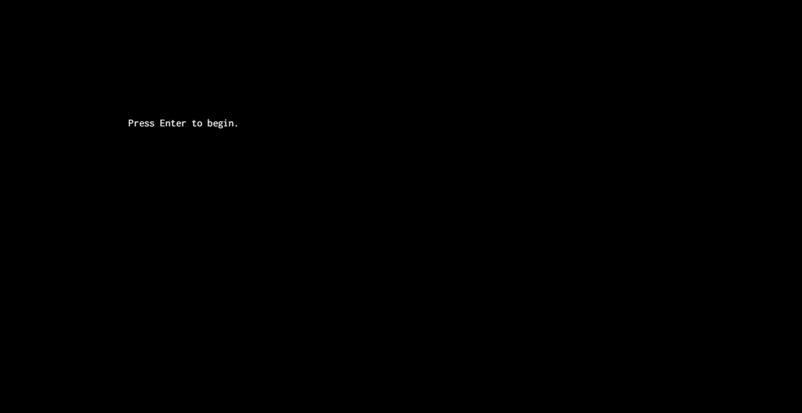

# Homework 5

[Latest Commit](https://github.com/swamulism/aether_of_enclaves/commit/750330dd2e08d355310ac22b616dda6ff12cffbf)

[Version 0.0.3 Release](https://github.com/swamulism/aether_of_enclaves/releases/tag/0.0.3)

1. What was planned for this deadline, from our check-in before break:
    - Collision detection between player and ship.
    - Ship is moveable.
    - Have some world generated (stretch).

2. What was accomplished:
    - Collision detection between the ship and player was successfully implemented. Moving forward, we would like to refactor the code and move this functionality to somewhere more proper than where it is now. A general "collision-with-ship" function was written to be applied to other NPCs.
    - The ship is moveable. The Player can change "control states" (i.e. controlling the player versus controlling the ship) by pressing V (subject to change). This allows the player to move as its own entity upon the ship, while the ship is moving. (See demo clip below.)
    - This deadline required a lot of refactoring to how we were handling input. We've preserved the integrity of using the Command design pattern as best we can, but after some research and input, decided that strictly trying to force an object-oriented design in Rust would not be the best model for our code. As a result, much of the input handler was collapsed into the Game class as a whole. This will allow us to make the code more modular. 

3. Planned for next deadline:
    - Basic generation of some world using the Map class and expanding upon tile sets.
    - Interaction with items and basic use of inventory (picking them up, consuming, throwing).
    - NPCs appear on screen (stretch).

4. Demo clip below.

