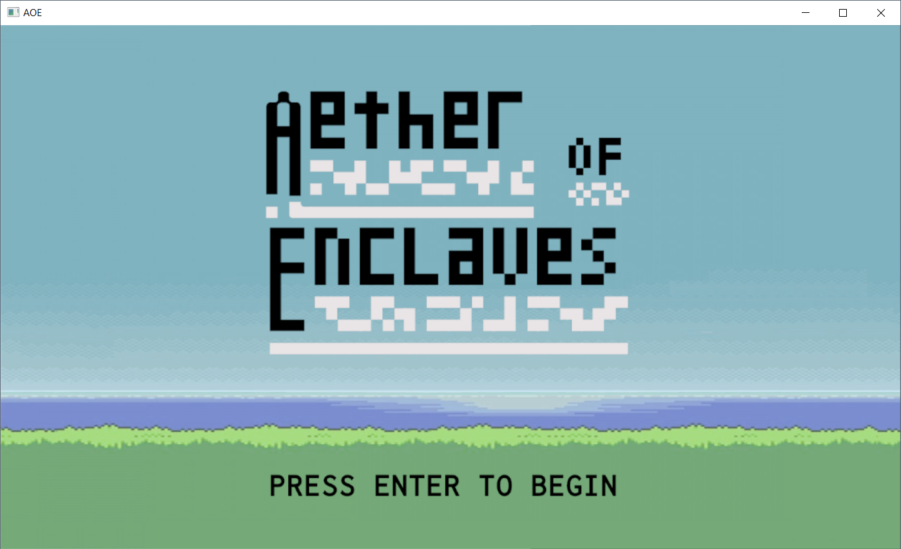

# Homework 6

[Latest Commit]()

[Version 0.0.3 Release]()

1. What was planned for this deadline, from our check-in before break:
    - Basic generation of some world using the Map class and expanding upon tile sets.
    - Interaction with items and basic use of inventory (picking them up, consuming, throwing).
    - NPCs appear on screen (stretch).

2. What was accomplished:
    - We have successfully started generating the world, which features a few different tilesets. We updated our tile graphics to reflect our color scheme. The world is generated randomly using two different generation methods.
    - We worked on expanding our items. Originally, we thought we would work on picking them up, back got distracted before getting that far. We worked on sprites for each item, and successfully placed one on the map. There's not much to do here before we have implemented basic interaction.
    - We felt that the aesthetic of the game was rather lackluster, and didn't feel like much of a "game". So, we strayed from our original path in order to implement animation with the main character, requiring a new set of sprites and a large chunk of code controlling the player's directin. We think it looks much nicer now.
    - Along the lines of game aesthetic, we decided to make a basic title screen.

3. Planned for next deadline:
    - We want to make the world generation a bit more advanced - this is intentionally vague, because this could head in a number of directions.
    - We'd like to have the main character move on the world itself (move from ship to world and back).
    - Finish the item interaction mentioned above (picking them up, throwing them).
    - Rewrite a large number of comments and tests, as the large number of updates how outdated a lot of these.

4. Screenshot and gif below.

